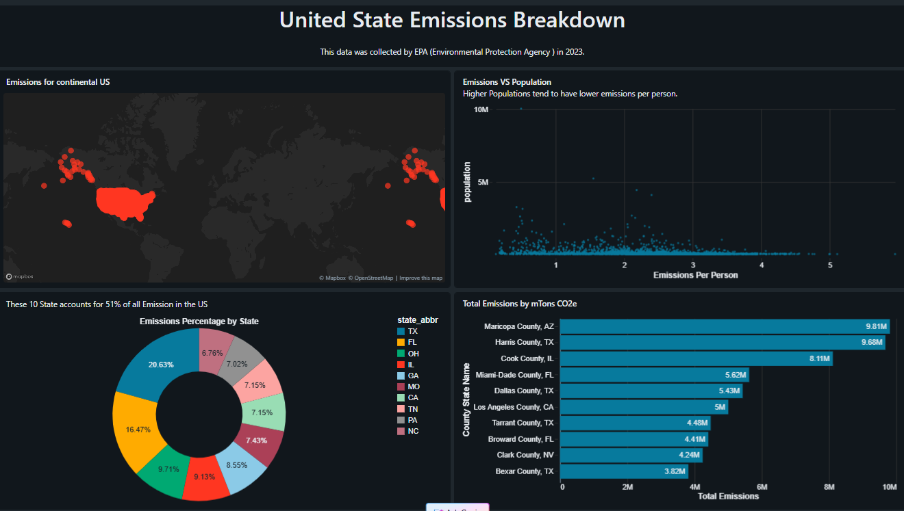
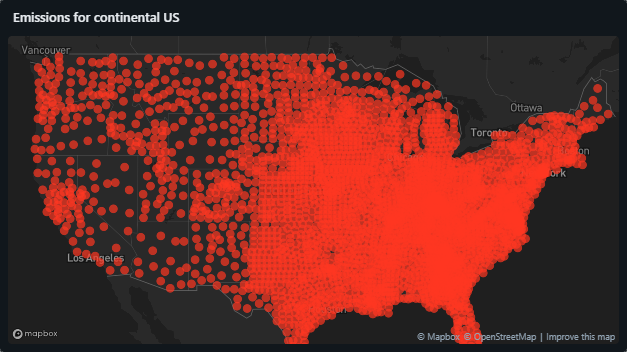
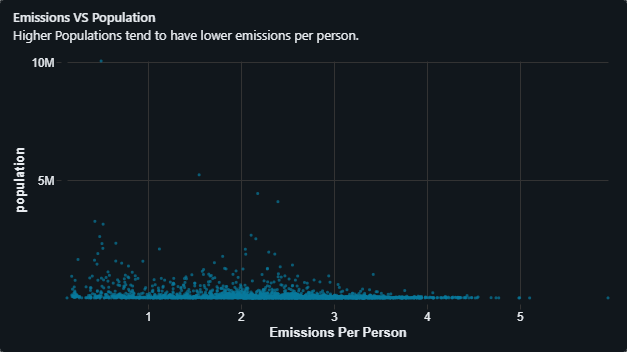
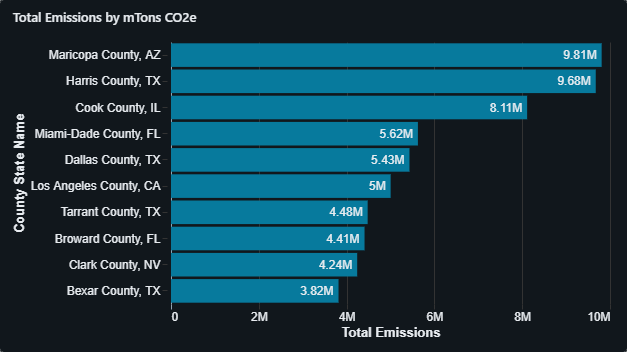
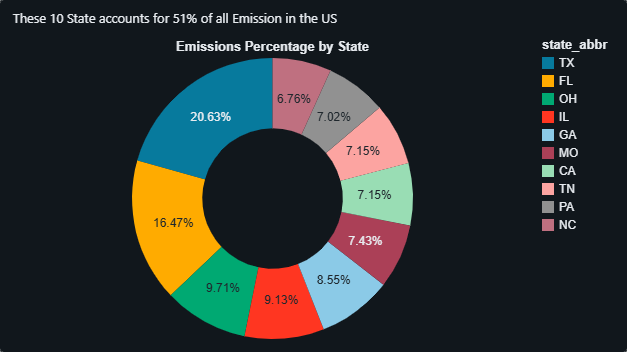

# Emissions Dashboard

A comprehensive Databricks dashboard analyzing greenhouse gas (GHG) emissions data across US counties and states, with geographic visualization and per capita analysis.

## 🎯 Overview

This project provides interactive visualizations of GHG emissions data, enabling analysis of:
- **Geographic distribution** of emissions across the United States
- **Per capita emissions** by county and population
- **State-level aggregations** identifying top emitters
- **County-level rankings** for detailed regional analysis

## 📊 Dashboard Components

### Visualizations

1. **Geographic Map** - Location-based emissions visualization using latitude/longitude coordinates
2. **Emissions Per Person** - Bar chart showing per capita emissions by county
3. **Top 10 States** - Bar chart of states with highest total emissions
4. **Top 10 Counties** - Bar chart identifying highest-emitting counties

### Key Metrics

- Total GHG emissions (in millions of tons CO2e)
- Per capita emissions calculations
- State and county rankings
- Population correlations

## 📸 Dashboard Screenshots

### Full Dashboard Overview

*Complete view of the Emissions Dashboard with all visualizations*

### Individual Visualizations

#### 1. Geographic Emissions Map


*Interactive map showing emissions distribution across US counties by latitude/longitude*

#### 2. Emissions Per Person


*Bar chart displaying per capita emissions by county*

#### 3. Top 10 States by Total Emissions


*Bar chart ranking the top 10 states by total GHG emissions*

#### 4. Top 10 Counties by Total Emissions

*Bar chart identifying the highest-emitting counties*

> **Note:** To view the live interactive dashboard, import the `dashboard/Emissions Dashboard.lvdash.json` file into your Databricks workspace.

## 📁 Repository Structure

```
Emissions-Dashboard/
├── README.md                      # This file
├── dashboard-definition.json      # Complete dashboard configuration
├── queries/                       # SQL queries for each dataset
│   ├── location_data.sql         # Geographic emissions data
│   ├── emissions_per_person.sql  # Per capita calculations
│   ├── emissions_per_state.sql   # State-level aggregations
│   └── county_shaming.sql        # Top counties by emissions
├── dashboard/                     # Dashboard files
│   ├── Emissions Dashboard.lvdash.json
│   └── emissions-dashboard-documentation.md
└── notebooks/                     # Related Databricks notebooks
```

## 🗄️ Data Source

**Unity Catalog Location:**
- **Catalog:** `emissions`
- **Schema:** `default`
- **Table:** `emissions_data`

**Key Columns:**
- `latitude`, `longitude` - Geographic coordinates
- `GHG emissions mtons CO2e` - Emissions in millions of tons CO2 equivalent
- `county_state_name` - County and state identifier
- `state_abbr` - State abbreviation
- `population` - County population

## 🚀 Setup Instructions

### Prerequisites

- Databricks workspace with access
- Unity Catalog enabled
- Access to `emissions.default.emissions_data` table

### Importing the Dashboard

1. **Clone this repository** into your Databricks workspace:
   ```bash
   # Using Databricks Repos
   # Go to Repos → Add Repo → https://github.com/Kisan303/Emissions-Dashboard.git
   ```

2. **Import the dashboard:**
   - Navigate to Dashboards in Databricks
   - Click "Create Dashboard"
   - Import `dashboard/Emissions Dashboard.lvdash.json`

3. **Verify data access:**
   ```sql
   SELECT COUNT(*) FROM emissions.default.emissions_data;
   ```

4. **Run queries** from the `queries/` directory to test each dataset

### Running Individual Queries

Each visualization has a corresponding SQL file in the `queries/` directory:

```sql
-- Test location data
source queries/location_data.sql

-- Test per capita emissions
source queries/emissions_per_person.sql

-- Test state rankings
source queries/emissions_per_state.sql

-- Test county rankings
source queries/county_shaming.sql
```

## 📈 Query Details

### Location Data
Retrieves latitude, longitude, and emissions for geographic mapping.

### Emissions Per Person
Calculates per capita emissions handling:
- Comma-separated number formatting
- Division by zero protection
- Ordered by highest per capita emissions

### Emissions Per State
Aggregates total emissions by state:
- Handles comma formatting in source data
- Groups by state abbreviation
- Returns top 10 states

### County Shaming
Identifies highest-emitting counties:
- Converts string emissions to numeric
- Includes population context
- Limited to top 10 results

## 🔧 Technical Details

### Data Transformations

All queries handle:
- **Comma removal** from numeric strings: `REPLACE(column, ',', '')`
- **Type casting** to double precision
- **Null handling** with `NULLIF()` for safe division
- **Case-insensitive ordering** for consistent results

### Performance Considerations

- Queries are optimized with `LIMIT` clauses
- Aggregations use efficient `GROUP BY` operations
- Indexes on `state_abbr` and `county_state_name` recommended

## 📊 Workspace Information

- **Workspace URL:** https://dbc-ce5c7ebc-9595.cloud.databricks.com
- **Workspace ID:** 7474644337336290
- **Dashboard ID:** 01f170cf76af10b2be836edb371de2e6

## 🤝 Contributing

To contribute to this dashboard:

1. Clone the repository
2. Create a feature branch
3. Make your changes
4. Test queries against the emissions data
5. Submit a pull request with:
   - Query changes in `queries/` directory
   - Updated `dashboard-definition.json` if needed
   - Documentation updates

## 📝 License

This project is part of a Databricks workspace analytics suite.

## 📧 Contact

For questions or access requests, please contact the workspace administrator.

## 🔗 Related Resources

- [Databricks Documentation](https://docs.databricks.com/)
- [Unity Catalog Guide](https://docs.databricks.com/data-governance/unity-catalog/index.html)
- [Lakeview Dashboards](https://docs.databricks.com/dashboards/index.html)

---

**Last Updated:** June 25, 2026  
**Created by:** Kisan Rai (kisanrai939@gmail.com)
